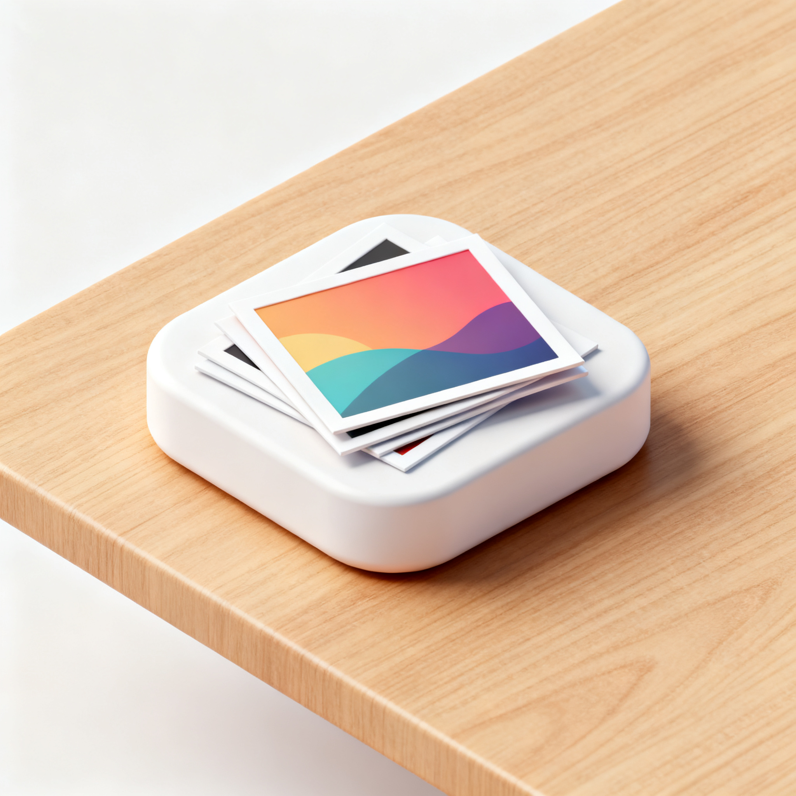

# Photo Widget

 

这是一个轻量级的桌面小部件，用于在您的桌面上显示随机图片。它旨在提供一个美观且不干扰工作或娱乐的图片展示方式，支持自定义图片文件夹、刷新间隔和窗口尺寸。

## ✨ 功能特性

*   **自定义图片文件夹**: 添加您喜爱的图片收藏所在的多个文件夹。
*   **随机图片展示**: 自动从指定文件夹中随机选择并显示图片。
*   **可配置刷新间隔**: 设置图片自动切换的时间间隔（秒、分钟、小时），也可以禁用自动刷新。
*   **智能图片加载**:
    *   根据图片的原始尺寸和您的配置，优化图片显示，支持 `Cover`（填充并裁剪）和 `Contain`（适应窗口并调整窗口大小）两种模式。
    *   可根据横向或纵向过滤图片。
*   **灵活的窗口控制**:
    *   **无边框透明窗口**: 融入桌面，不占用任务栏空间。
    *   **"总是置顶"选项**: 确保图片小部件始终可见。
    *   **多锚点调整**: 在窗口尺寸变化时，可以选择保持窗口的中心、左上角、右上角、左下角或右下角位置不变。
    *   **自动屏幕边界检查**: 防止窗口在屏幕外丢失，会自动将其拉回屏幕内。
    *   **拖动条**: 鼠标悬停时显示可拖动窗口的控制条。
    *   **点击切换**: 点击图片即可切换到下一张。
    *   **右键菜单**: 右键点击图片或通过系统托盘图标快速访问设置。
*   **托盘图标集成**: 提供系统托盘图标，方便访问设置和退出应用。
*   **持久化配置**: 自动保存您的设置到本地文件。

## 🚀 如何运行

1.  **下载可执行文件**: 访问 [Releases](https://github.com/Kevin589981/desktop-widget/releases) 下载最新版的 `photo_widget.exe` (或您操作系统的对应可执行文件)。
2.  **运行**: 双击下载的可执行文件即可启动。它将作为一个无边框的窗口出现在您的桌面上，并在系统托盘中显示一个图标。
3.  **初次设置**: 首次运行时，可能需要右键点击图片或系统托盘图标，选择“Settings”来添加您的图片文件夹。

## 🛠️ 如何构建

本项目使用 Rust 语言和 `eframe` GUI 框架。

**前提条件**:

*   安装 [Rust](https://www.rust-lang.org/tools/install)。

**构建步骤**:

1.  **克隆仓库**:
    ```bash
    git clone https://github.com/Kevin589981/desktop-widget.git
    cd desktop-widget
    ```
    

2.  **构建**:
    ```bash
    cargo build --release
    ```
    这将在 `target/release/` 目录下生成可执行文件。

## ⚙️ 配置文件

项目配置保存在一个名为 `photo_widget_config.json` 的文件中，位于应用程序运行的同一目录下。
您可以手动编辑此文件，但通常建议通过应用程序的设置界面进行修改。

**示例配置 (photo_widget_config.json):**

```json
{
  "folders": [
    "C:\\Users\\YourUser\\Pictures",
    "/home/youruser/Images"
  ],
  "always_on_top": true,
  "refresh_interval": 300,
  "refresh_value": 5,
  "refresh_unit": "Minutes",
  "landscape_width": 400.0,
  "landscape_height": 300.0,
  "portrait_width": 300.0,
  "portrait_height": 400.0,
  "fit_mode": "Cover",
  "resize_anchor": "Center",
  "orientation_filter": "Both"
}
```

## 📄 许可证

本项目根据 **Apache License, Version 2.0** 许可证发布。您可以在 [LICENSE](LICENSE) 文件中查看完整的许可证文本。

**Apache 许可证概要:**

允许您自由使用、修改和分发本软件，无论是商业用途还是非商业用途。但您必须：

*   保留所有版权、专利、商标和归属通知。
*   在任何修改过的文件中声明您所做的修改。
*   在分发软件时包含许可证副本和 NOTICE 文件（如果存在）。
